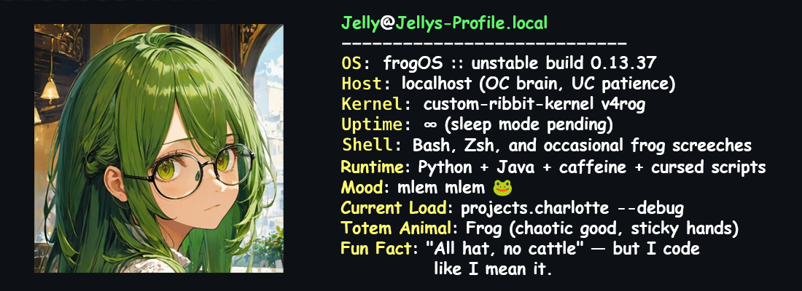

<pre style="background-color: #1e1e1e; color: #c7c7c7; padding: 20px; border-radius: 40px; border: 1px solid #555; margin-right: 30px; font-family: monospace; overflow-x: auto;">
$ ssh jelly@github.com
Welcome to the frogpond.
Type 'help' to list available projects.
</pre>

---

### ₍𝄐 ̫͡ 𝄐₎ `$ neofetch`

 

---

### `ԅ(≖‿≖ԅ)` $ curl jellytyan.dev/projects
<pre style="background-color: #1e1e1e; color: #c7c7c7; padding: 20px; border-radius: 40px; border: 1px solid #555; font-family: monospace; overflow-x: auto;">
$ curl github.com/jellytyan/stats
> Connecting to github.com...
> Retrieving stats...
> Rendering coolness...
</pre>
| Repo | Stars | Description |
|------|:-----:|-------------|
| [**Marmeladka**](https://github.com/JellyTyan/Marmeladka) |  | Discord bot with weird features |
| [**Zefirka**](https://github.com/JellyTyan/Zefirka) |  | Discord music bot with Kazagumo |
| [**Bismark**](https://github.com/NullPointerGang/bismark) |  | YouTube downloader web UI |
| [**Kokoro No Kiroku**](https://github.com/JellyTyan/KokoroNoKiroku) |  | Very beautiful and usefull anime list |
| [**Charlotte**](https://github.com/JellyTyan/Charlotte-v2) |  | Telegram content downloader bot |
---
### `(•̀ᴗ•́)و ̑̑` $ ls skills/*

<!-- 
 -->
  
<!-- 
 -->

---

### `(っ•́｡•́)♪♬` $ curl github.com/jellytyan/analytics

<pre style="background-color: #1e1e1e; color: #c7c7c7; padding: 20px; border-radius: 40px; border: 1px solid #555; font-family: monospace; overflow-x: auto;">
$ curl github.com/jellytyan/analytics
> Connecting to github.com...
> Retrieving stats...
> Rendering coolness...
</pre>

  
  

  

<pre style="background-color: #1e1e1e; color: #c7c7c7; padding: 10px; border-radius: 10px; font-family: monospace;">
# wow such skills, much frogs 🐸✨
# fullstack.exe has entered the swamp
</pre>

---
### `(づ｡◕‿‿◕｡)づ` $ ls connect/*

---
### `\(ᵔᵕᵔ)/` $ ls support/*

---

<!-- Optional Snake animation -->
